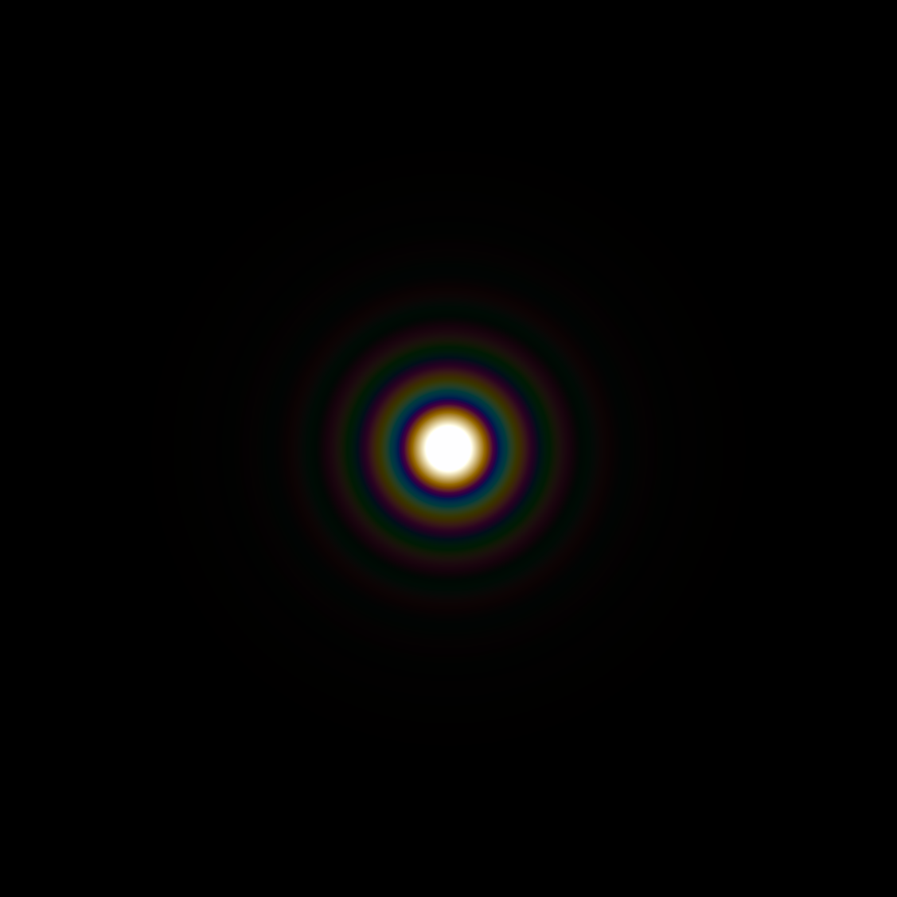
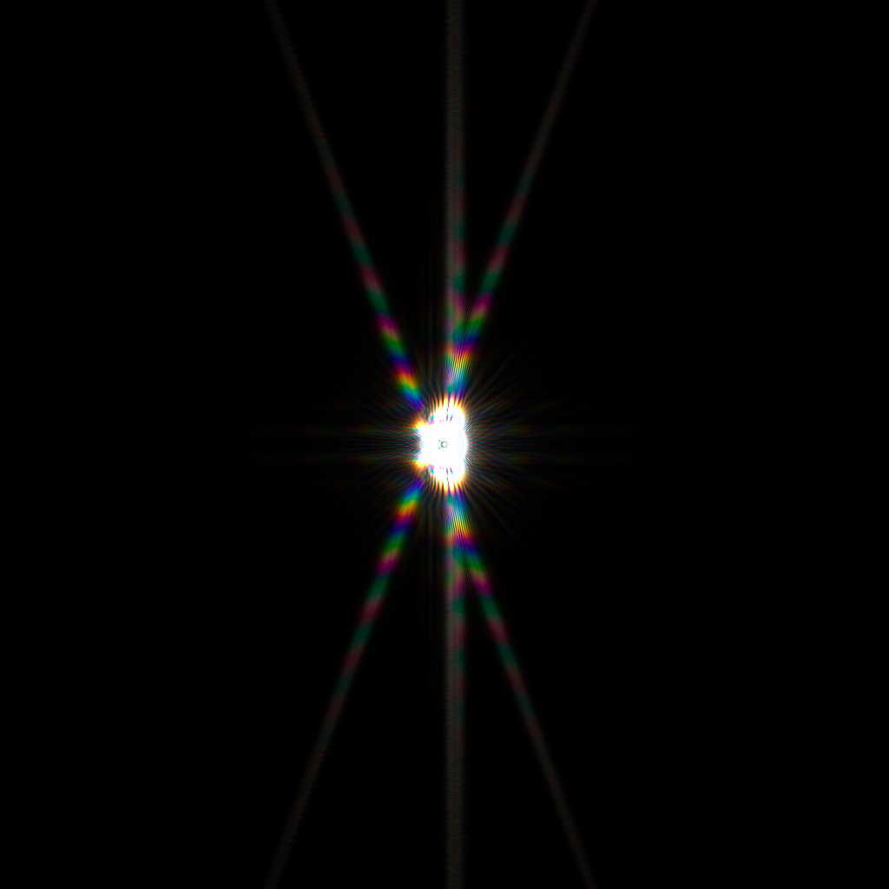

# Summed Field Method
The Angular Spectrum Method (ASM)is a computationally efficient technique for evaluating the Rayleigh-Sommerfeld diffraction integral, without invoking paraxial approximations.
The ASM, unlike approximate methods, requires sampling of the aperture phase at the Nyquist interval, resulting in enormous memory use for large, high numerical aperture (NA) systems.
This crate implements the Summed Field Method[1], a modified ASM that is suitable for high NA focusing systems. This method allows the size of the output field to be configured independent of the aperture size, with memory usage reducing proportionally.

Convenience methods are supplied for determining the required aperture sampling.

Feel free to open an issue for general discussion or to raise any problems.

## Examples Output
The examples below display multispectral outputs rendered under photopic vision assumptions, with a 6500K illuminant, using the  crate and CIE CMFs.

Airy Disk

Bahtinov Diffraction Grating - 500µm defocus

## References
[1] M. Hillenbrand, A. Hoffmann, D. Kelly, and S. Sinzinger1, *Fast nonparaxial scalar focal field calculations*, Optical Society of America, 2014

## License
MIT
